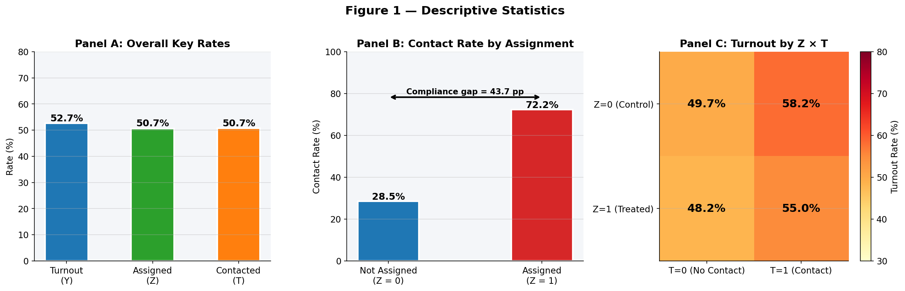
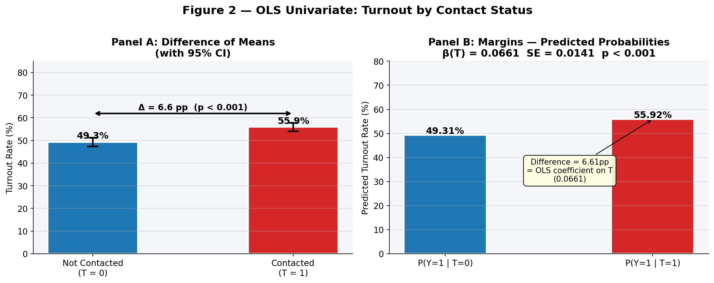
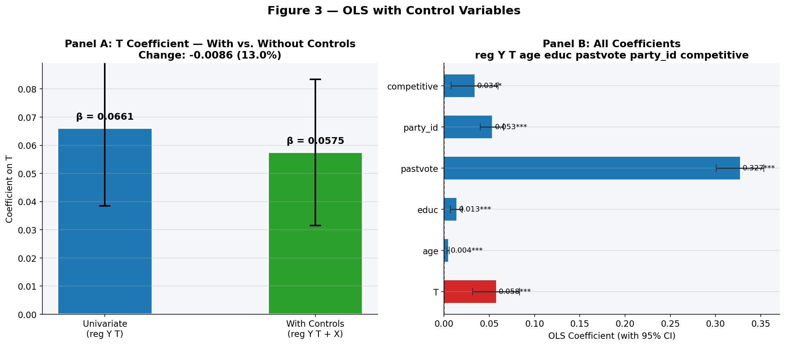
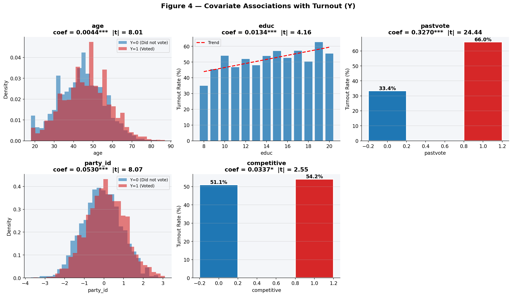
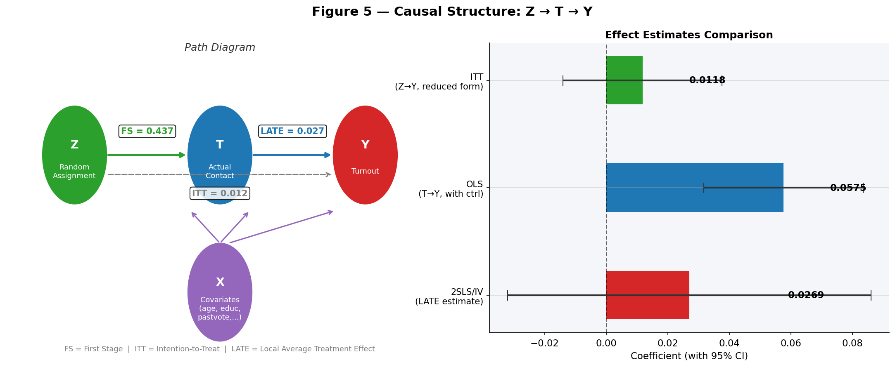
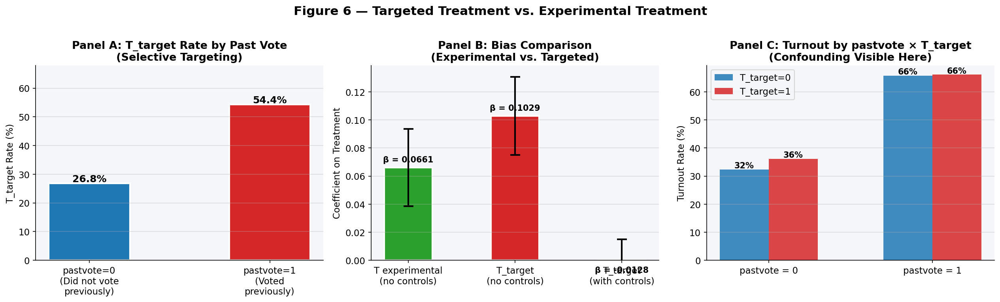

# INTL 601 Research Methods I - Exercise #1
## Voter Mobilization Field Experiment

---

## 1. Data Overview

The dataset contains 5,000 observations from a simulated voter mobilization field experiment based on Gerber and Green (2000). The key variables are:

| Variable | Type | Description |
|----------|------|-------------|
| `Y` | Binary | Outcome: 1 = voted, 0 = did not vote |
| `Z` | Binary | Random assignment: 1 = assigned to canvassing, 0 = not assigned |
| `T` | Binary | Treatment received: 1 = actually contacted, 0 = not contacted |
| `age` | Integer | Voter age |
| `educ` | Integer | Years of education |
| `pastvote` | Binary | Past turnout (1 = voted before, 0 = did not) |
| `party_id` | Continuous | Partisan strength (higher = stronger partisan) |
| `competitive` | Binary | District competitiveness (1 = competitive) |

**Descriptive statistics:**

|             |   mean |    std |    min |    max |
|:------------|-------:|-------:|-------:|-------:|
| Y           |  0.527 |  0.499 |  0     |  1     |
| Z           |  0.507 |  0.5   |  0     |  1     |
| T           |  0.507 |  0.5   |  0     |  1     |
| age         | 45.226 | 11.912 | 18     | 87     |
| educ        | 13.96  |  2.037 |  8     | 20     |
| pastvote    |  0.591 |  0.492 |  0     |  1     |
| party_id    |  0.005 |  1.001 | -3.714 |  3.099 |
| competitive |  0.507 |  0.5   |  0     |  1     |

**Key rates:**

| Metric | Value |
|--------|-------|
| Turnout rate (Y = 1) | 52.7% |
| Assignment rate (Z = 1) | 50.7% |
| Contact rate (T = 1) | 50.7% |
| Contact rate given Z = 1 | 72.2% |
| Contact rate given Z = 0 | 28.5% |
| Compliance gap | 43.7 percentage points |

Among those assigned to canvassing (Z = 1), 72.2% were actually contacted, compared to 28.5% among those not assigned (Z = 0), a compliance gap of 43.7 pp. Compliance is imperfect in both directions: some assigned voters were never contacted (never-takers) and some non-assigned voters were contacted through other channels (always-takers). This is a case of **two-sided noncompliance**.



---

## 2. OLS Univariate Analysis and Difference of Means

**Difference-of-means test:**

| Group | N | Mean Turnout |
|-------|---|-------------|
| Not contacted (T = 0) | 2,466 | 49.31% |
| Contacted (T = 1) | 2,534 | 55.92% |
| Difference | - | 6.61 pp |

Two-sample t-test: t = 4.689, p < 0.001

**OLS regression: reg Y T**

| Variable | Coef | Std Err | t | p-value | 95% CI |
|----------|------|---------|---|---------|--------|
| Intercept | 0.4931*** | 0.0100 | 49.142 | < 0.001 | [0.4734, 0.5128] |
| T | 0.0661*** | 0.0141 | 4.689 | < 0.001 | [0.0385, 0.0937] |

*N = 5000 | R² = 0.0044 | \*p<0.05 \*\*p<0.01 \*\*\*p<0.001*

**Margins: predicted probabilities at T = 0 and T = 1:**

| | Value |
|--|-------|
| P(Y = 1 \| T = 0) | 0.4931 (49.31%) |
| P(Y = 1 \| T = 1) | 0.5592 (55.92%) |
| Difference | 0.0661 (6.61 pp) |

In a linear probability model (LPM), the coefficient on a binary treatment equals the difference in predicted means between the two groups. The difference in predicted probabilities (6.61 pp) is exactly equal to the OLS coefficient on T (0.0661). The `margins at(T=(0 1))` command in Stata recovers the same quantity as computing predicted values at T = 0 and T = 1 from the regression.



---

## 3. OLS with Control Variables

**Regression: reg Y T age educ pastvote party_id competitive**

| Variable | Coef | Std Err | t | p-value | 95% CI |
|----------|------|---------|---|---------|--------|
| Intercept | -0.1011 | 0.0534 | -1.893 | 0.058 | [-0.2059, 0.0036] |
| T | 0.0575*** | 0.0132 | 4.348 | < 0.001 | [0.0316, 0.0834] |
| age | 0.0044*** | 0.0006 | 8.006 | < 0.001 | [0.0033, 0.0055] |
| educ | 0.0134*** | 0.0032 | 4.159 | < 0.001 | [0.0071, 0.0198] |
| pastvote | 0.3270*** | 0.0134 | 24.444 | < 0.001 | [0.3008, 0.3532] |
| party_id | 0.0530*** | 0.0066 | 8.070 | < 0.001 | [0.0401, 0.0659] |
| competitive | 0.0337* | 0.0132 | 2.552 | 0.011 | [0.0078, 0.0595] |

*N = 5000 | R² = 0.1345 | \*p<0.05 \*\*p<0.01 \*\*\*p<0.001*

The coefficient on T changes from 0.0661 to 0.0575 when controls are added, a change of -0.0086 (13.0%). This small change is expected: because T derives from random assignment Z, T is approximately uncorrelated with pre-treatment covariates. Adding controls in a randomized experiment primarily increases precision rather than correcting omitted-variable bias.

In a linear probability model, the marginal effect of T equals the regression coefficient: **0.0575**.

**Control variables ranked by absolute t-statistic:**

| Variable | Coefficient | Std Err | t-statistic | p-value |
|----------|------------|---------|-------------|---------|
| **pastvote** | 0.3270 | 0.0134 | **24.44** | < 0.001 |
| **party_id** | 0.0530 | 0.0066 | **8.07** | < 0.001 |
| **age** | 0.0044 | 0.0006 | **8.01** | < 0.001 |
| **educ** | 0.0134 | 0.0032 | **4.16** | < 0.001 |
| **competitive** | 0.0337 | 0.0132 | **2.55** | 0.011 |

**`pastvote`** has the largest absolute t-statistic (|t| = 24.44), indicating the strongest marginal association with turnout after controlling for all other variables.





---

## 4. Causal Structure: Z -> T -> Y

**First stage: reg T ~ Z + covariates**

| Variable | Coef | Std Err | t | p-value | 95% CI |
|----------|------|---------|---|---------|--------|
| Intercept | 0.1038* | 0.0517 | 2.009 | 0.045 | [0.0025, 0.2051] |
| Z | 0.4369*** | 0.0126 | 34.564 | < 0.001 | [0.4121, 0.4616] |
| age | 0.0031*** | 0.0005 | 5.817 | < 0.001 | [0.0020, 0.0041] |
| educ | 0.0001 | 0.0031 | 0.032 | 0.974 | [-0.0060, 0.0062] |
| pastvote | 0.0025 | 0.0129 | 0.193 | 0.847 | [-0.0227, 0.0277] |
| party_id | -0.0068 | 0.0063 | -1.084 | 0.278 | [-0.0192, 0.0055] |
| competitive | 0.0774*** | 0.0126 | 6.118 | < 0.001 | [0.0526, 0.1022] |

*N = 5000 | R² = 0.2028 | \*p<0.05 \*\*p<0.01 \*\*\*p<0.001*

The Z coefficient (0.4369, t = 34.564, p < 0.001) shows that random assignment raises the probability of contact by 43.7 pp. The instrument is strong (F-statistic well above 10).

**Reduced form (ITT): reg Y ~ Z + covariates**

| Variable | Coef | Std Err | t | p-value | 95% CI |
|----------|------|---------|---|---------|--------|
| Intercept | -0.0875 | 0.0539 | -1.624 | 0.104 | [-0.1931, 0.0181] |
| Z | 0.0118 | 0.0132 | 0.893 | 0.372 | [-0.0141, 0.0376] |
| age | 0.0046*** | 0.0006 | 8.341 | < 0.001 | [0.0035, 0.0057] |
| educ | 0.0134*** | 0.0032 | 4.130 | < 0.001 | [0.0070, 0.0197] |
| pastvote | 0.3271*** | 0.0134 | 24.405 | < 0.001 | [0.3008, 0.3534] |
| party_id | 0.0526*** | 0.0066 | 7.996 | < 0.001 | [0.0397, 0.0655] |
| competitive | 0.0381** | 0.0132 | 2.889 | 0.004 | [0.0122, 0.0639] |

*N = 5000 | R² = 0.1314 | \*p<0.05 \*\*p<0.01 \*\*\*p<0.001*

The Z coefficient (0.0118) is the Intention-to-Treat (ITT) effect: the average effect of being assigned to canvassing across all assigned voters, including those never actually contacted. The ITT is not statistically significant (p = 0.372).

**2SLS / IV estimate (LATE):**

| Estimator | Estimate | Std Err | t-stat | p-value |
|-----------|----------|---------|--------|---------|
| ITT (reduced form) | 0.0118 | 0.0132 | 0.893 | 0.372 |
| First stage (Z->T) | 0.4369 | 0.0126 | 34.564 | < 0.001 |
| LATE = ITT / FS | 0.0269 | - | - | - |
| 2SLS estimate | 0.0269 | 0.0301 | 0.894 | 0.371 |
| OLS (T->Y, with controls) | 0.0575 | 0.0132 | 4.348 | < 0.001 |

LATE = ITT / First Stage = 0.0118 / 0.4369 = 0.0269, which matches the 2SLS estimate (0.0269).

Neither the ITT (0.0118, p = 0.372) nor the LATE (0.0269, p = 0.371) reaches statistical significance at conventional levels. The OLS estimate (0.0575) is statistically significant but reflects selection: contacted voters differ from non-contacted voters in ways that predict turnout independently of canvassing.

The causal structure separates three estimands:

| Question | Estimand | Estimate |
|----------|----------|----------|
| Effect of being assigned to canvassing | ITT | 0.0118 |
| Effect of actual contact for compliers | LATE (2SLS) | 0.0269 |
| Association of contact with turnout (with controls) | OLS | 0.0575 |

Z affects Y only through T (exclusion restriction). The ITT (0.0118) captures the path Z -> T -> Y. Dividing by the first stage (0.4369) rescales to the LATE (0.0269), which is the average treatment effect for compliers only.



---

## 5. Targeted Treatment and Confounding Bias

A non-random targeted treatment indicator is generated as:

```python
T_target = (runiform() < invlogit(-1 + 1.2*pastvote + 0.5*party_id))
```

Voters with prior voting history and stronger partisan identity are more likely to be targeted. Both characteristics also independently predict higher turnout, creating confounding.

T_target rate: **43.1%**

**Contact rate by past vote (tab T_target pastvote, row):**

|   pastvote |       0 |       1 |
|-----------:|--------:|--------:|
|          0 | 73.1898 | 26.8102 |
|          1 | 45.636  | 54.364  |

Voters who previously voted are far more likely to receive the targeted treatment (54.4% vs. 26.8%), creating a direct correlation between T_target and Y through pastvote.

**Regression without controls: reg Y T_target**

| Variable | Coef | Std Err | t | p-value | 95% CI |
|----------|------|---------|---|---------|--------|
| Intercept | 0.4822*** | 0.0093 | 51.778 | < 0.001 | [0.4640, 0.5005] |
| T_target | 0.1029*** | 0.0142 | 7.253 | < 0.001 | [0.0751, 0.1307] |

*N = 5000 | R² = 0.0104 | \*p<0.05 \*\*p<0.01 \*\*\*p<0.001*

**Regression with controls: reg Y T_target age educ pastvote party_id competitive**

| Variable | Coef | Std Err | t | p-value | 95% CI |
|----------|------|---------|---|---------|--------|
| Intercept | -0.0779 | 0.0534 | -1.457 | 0.145 | [-0.1826, 0.0269] |
| T_target | -0.0128 | 0.0142 | -0.900 | 0.368 | [-0.0406, 0.0151] |
| age | 0.0046*** | 0.0006 | 8.362 | < 0.001 | [0.0035, 0.0057] |
| educ | 0.0133*** | 0.0032 | 4.117 | < 0.001 | [0.0070, 0.0197] |
| pastvote | 0.3305*** | 0.0140 | 23.681 | < 0.001 | [0.3032, 0.3579] |
| party_id | 0.0540*** | 0.0068 | 7.990 | < 0.001 | [0.0407, 0.0672] |
| competitive | 0.0378** | 0.0132 | 2.871 | 0.004 | [0.0120, 0.0637] |

*N = 5000 | R² = 0.1314 | \*p<0.05 \*\*p<0.01 \*\*\*p<0.001*

**Coefficient comparison:**

| Model | Coefficient on Treatment | Notes |
|-------|------------------------|-------|
| T experimental (no controls) | 0.0661 | Random assignment - unbiased |
| T_target (no controls) | 0.1029 | Biased upward by confounding |
| T_target (with controls) | -0.0128 | Effect disappears; sign reverses |

When controls are added, the T_target coefficient drops from 0.1029 to -0.0128: the estimated effect reverses sign and becomes statistically insignificant, indicating the apparent treatment effect was entirely due to confounding by pre-existing characteristics. The experimental T estimate (0.0661) is unbiased because random assignment ensures T is uncorrelated with confounders.

**What drives the confounding?**

| Variable | T_target coefficient | Y coefficient | Confounder? |
|----------|---------------------|---------------|-------------|
| pastvote | 0.2744 | 0.3270 | Yes - strong |
| party_id | 0.1087 | 0.0530 | Moderate |
| age | 0.0007 | 0.0044 | Negligible |

**pastvote** is the primary confounder: it strongly predicts T_target (coefficient of 1.2 in the logit formula by construction) and is the strongest predictor of Y among all covariates (|t| = 24.44 in the outcome regression).



---

## 6. Summary

| Estimator | Coefficient | Notes |
|-----------|------------|-------|
| Diff-of-means: E[Y\|T=1] - E[Y\|T=0] | 0.0661 | Raw association |
| OLS: reg Y T | 0.0661 | Equal to diff-of-means |
| OLS: reg Y T + controls | 0.0575 | Controlled association |
| ITT (Z->Y, reduced form) | 0.0118 | p = 0.372 (not significant) |
| LATE (2SLS) | 0.0269 | p = 0.371 (not significant) |
| T_target (no controls) | 0.1029 | Biased by confounding |
| T_target (with controls) | -0.0128 | Effect disappears |

---

*Analysis conducted in Python using pandas, statsmodels, scipy, linearmodels, matplotlib, and seaborn.*
*Dataset: gg_fake.dta - 5,000 simulated observations (teaching dataset).*
